**Apps**

**whatisanapp?**

> computer software or a program most commonly a small specific one used
> for mobile devices. The term app originally refered to any mobile or
> desktop application, but as more app stores have emerged to sell
> mobile apps to smartphone and tablet users, the term app has evolved
> to refer to small programs that can be downloaded and installed at
> once - techopedia
>
> a program package to solve a problem
>
> example - firefox, instagram, vs code, amazon, chrome, safari,
> twitter, word, terminal emulator etc **desktopapplications** -
>
> usually standalone, editors, word processors, web browser, mail etc
> often work offline, local data storage, possible network connection
> software development kits SDK custom frameworks, OS specific
>
> **mobileapps** -
>
> targetted at mobile platforms - phone, tablets constraints -
>
> limited screen space
>
> user interaction (touch, audio, camera) memory processing power
>
> battery framework -
>
> OS specific (android studio, xcode) cross-platform (flutter, react
> native)
>
> Network -
>
> usually network oriented cocoa touch - apple specific framework
>
> **webapps** -
>
> the **platform**
>
> works across OS device, create a common base
>
> heavily network oriented, mostly cant work without network, but
> possible workarounds for offline processing
>
> main focus of this course

**componentsofanapp**

> storage computation presentation

**example-emailclient**

**storage**

> where are the emails stored?
>
> how are they stored on the server? file format etc

**compute**

> indexing of emails for fast access searching
>
> security

**presentation**

> display list of mails
>
> rendering / display of individual mails

**platforms:**

**desktop**

> keyboard, mouse, video
>
> desktop paradigm - folders, files, documents, etc

**mobile**

> touch screen
>
> voice, tilt, camera interfaces small self-containted apps

**web-based**

> datacenter storage - persistent
>
> cloud - access anywhere, multi device

**embedded**

> simple function, limited scope ex- digital camera, watches, etc

**architectures**

> client server peer to peer

**clientserver**

**server**

> stores data
>
> provides data on demand may perform computations

**clients**

> end users request data
>
> user interaction, display

**network**

> connects server to client can be local
>
> data pipe - no alterations

**client** **-server** **model**

> explicit servers explicit clients local systems -
>
> both client and server are on same machine - local network
> comunication conceptually still a networked system
>
> machine clients -
>
> eg software / antivirus updaters need not have user interaction
>
> variants-
>
> multiple servers, single queue, multiple queues, load balancing
> frontends, etc examples:
>
> email databases
>
> whatsapp/messaging web browsing

**distributedpeertopeer**

> no distinction between client and server example - torrent
>
> all nodes are equipotent, no one is more important peer to peer model,
> all are equivalent
>
> error tolerance
>
> master / introducers needed
>
> eleciton / re-selection of masters on failure shared information
>
> example-torrent
>
> blockchain - based syetems
>
> IPFS(interplanetary file system), Tahoe (distributed file systems)

**Notes**

> CS model may be bottle-necked by high traffic at server P2P harder to
> choke
>
> P2P can be fast if P is near to us
>
> CS can fail if Server fails, P2P survives some failure P2P is
> expensive to maintain
>
> P2P is good for redundancy and data safety

**softwarearchitecturepatterns**

TLA three letter acronyms)

> Separation of Concerns -
>
> In computer science, separation of concerns is a design principle for
> separating a computer program into distinct sections. Each section
> addresses a separate concern, a set of information that affects the
> code of a computer program.
>
> fundamental structure of a software and rule of creating such
> structures and systems such that separation of concerns divides up the
> software into logical parts which are independent and provide an
> interface to each other, making development, testing, debugging, etc
> easier
>
> the layers are loosely coupled, they dont heavily depend on each other

**layeredarchitecture**

The layered architecture style is one of the most common architectural
styles. The idea behind Layered Architecture is that modules or
components with similar functionalities are
**organizedintohorizontallayers**. As a result,
**eachlayerperformsaspecificrole** within the application.

**designpattern-**

a general reusable solution to a commonly occuring problem within a
given context in software design

> some experienced developers notice patterns in code
>
> resusing those patterns can make design and development faster guide
> the design and thought process
>
> not only way to do things, but known good ways to do things

**Example:Userwantingtocheckmail**

> **User**: want to check mail **Server** has email
>
> **Model**: store emails on server, index, ready to manipulate
> **View**: display list of emails, read individual emails ,etc
> **Controller**: sort emails, delete, archive, etc

**MVC-modelviewcontroller**

a very good paradigm for application to build, but thrashed recently

> Model - core data to be stored for the application - stored and models
> the data databases, indexing for easy searching, manipulation
>
> View - user facing side of application - the UI and UX interfaces for
> finding information, manipulating
>
> Controller - business logic - how to manipulate data - brain of
> program, connects model and view

origins in smalltalk language 1979

view need not be visual, could be audio, tactile, etc

User uses controller → to manipulate the model → that updates the view →
that user sees

**otherdesignpatterns:**

> Model View Adapter MVA Model View Presenter MVP Model View Viewmodel
> MVV Hierarchical MVC
>
> Presentation Abstraction Control PAC

Each has its uses, but fundamentals are very similar

**Focusonthiscourse:**

**Platform:WebBased**

**Architecture:ClientServer**

**SoftwareArchitecture:MVC**

**ImportantNotes:**

> view layer also called presentation layer in MVP
>
> controller layer controls business logic of code, so can be called
> business layer in MVC, one model can have multiple views
>
> view may not be visual
>
> The controller can interact with the model and view

**whytheweb?**

> platform of choice for this course
>
> generic - works across platforms OS and hardware) build on sound
> underlying principles
>
> worth understanding
>
> constraints - what can and cannot be done (easily) cost: storage,
> network, device sizing, datacenter

**history**

> telephones are circuit switched - allow A to talk to B by having a
> physical connection between them (complex switching network) physical
> wires tied up for duration of call even if nothing is said
>
> so packet switching invented - here msg/data is broken into small
> packets and each packet contains its metadata (src, dest, etc) and is
> routed through common communication channels
>
> wire occupied only when data to be sent data instead of analog voice
>
> usage of hub-and-spoke model instead of mesh network, data multiplexed
> through one or more central wires, wires across all nodes not needed
>
> network is neutral to type of data
>
> IBM SNA, Digital DECNet, Xerox Ethernet, ARPANET Internet) etc
>
> As so many standards are there, we need protocols for
> intercommunications

**protocols**

> how to format packets; place them on wires; headers/checksums etc
>
> each network had its own protocol can we create inter-network?
>
> how to communicate between different network protocols ? or replace
> with a single internet protocol?
>
> **IP**: internet protocol 1983
>
> define headers, packet types, interpretation
>
> can be carried over different underlying networks: etherenet, DECnet,
> PPP, SLIP **TCP** Transmission Control Protocol 1983
>
> establsih a reliable communication - retry, error control, etc
> automatically scale and adjust to network limits
>
> it kind of creates a 'circuit switch' on top of a packet switch
> network it moderates send speed etc according to link capacity
>
> Thus TCP/IP is used in internet **DomianNames** 1985
>
> use names instead of IP addresses
>
> easy to remember - .com revolution still in the future **HyperText**
> 1989
>
> Text documents to be served
>
> formatting hints inside document to link to other documents
> (hypertext) by tim berners lee at CERN (switzerland)

**present**

> original web was limit static pages
>
> compliacted executable interfaces limited styling
>
> browser compatibility issues

**NOW**

> dynamic pages - generated on the fly
>
> http as a transport mechanism - binary data, serialised objects, etc
> client side computation and rendering
>
> platform agnostic operating system
>
> client tracking possible by cookies and sessions

**Notes**

> TCP is connection oriented (a connection (virtual) is needed before
> communication) UDP is connectionless, it just sends the packets,
> doesn't care about reliablity
>
> UDP can result in loss of data
>
> TCP requires acknowledgement after receiving data TCP/IP is a
> **sessioninitiationprotocol**
>
> **ARPANET** - advanced research projects agency network
>
> **protocol** - a set of rules that defines how the data packets are
> formed and placed on wires is called protocol IP bridges different
> network protocols and and defines a standardized header for all
> network protocols internet is network of networks that connects all
> devices on earth to each other
>
> WWW uses internet to showcase webpages (https etc) to users. WWW is
> collection of webpages

**howwebworks?**

**server**

> any computer with a network connection software -
>
> listen for incoming network connections on a fixed port(example 80
>
> respond in specific ways
>
> opening network connnections, ports etc already known to OS
>
> web server decides what to respond when some request is made, example
> sending a file when file is requested, rendering page on server side
> if required, RESTful JSON reply, etc
>
> protocol:
>
> what should client ask server?
>
> how should server respond to client? HTTP

**http**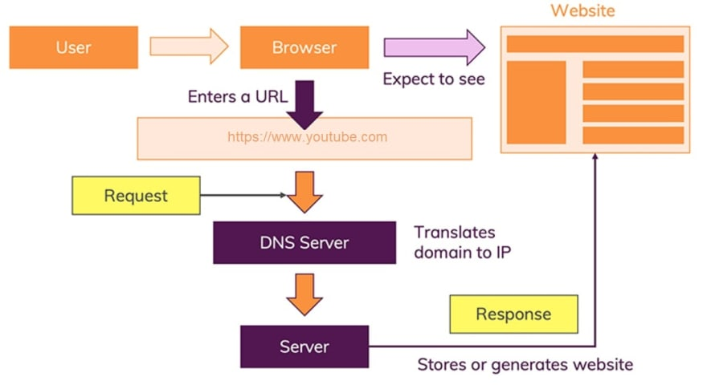

**hypertext** - regular text document that contains codes inside that
indicates special funtions how to link to other documents ( link →
hyperlink)

**hypertexttransferprotocol** - largely text based - client sends
request, server responds with hypertext document. nowadays used for lot
more than just sending HT documents.

**Notes**

> FTP file transfer protocol
>
> HTTP is stateless protocol, it sends request and server responds as
> per given state
>
> FTP is stateful protocol - client sends a request to server and
> expects some response, if it doesnt get a response, it re-sends the
> request
>
> Stateless HTTP, UDP, DNS Stateful FTP, Telnet
>
> in stateless the C and S are loosely coupled, in stateful the server
> and client are tightly bound stateless is easier to design the server
> and is faster than stateful
>
> HTTP uses port 80 FTP uses port 21
>
> Examples of web server Apache Web Server, Nginx, Boa Webserver,
> FoxServ, Lighttpd, Microsoft Web Server IIS, Savant, mongoose
>
> Internet is interconnection of networks, connecting devices to each
> other. WWW is collection of resources on the internet, like webpages
> etc.
>
> WWW is browsed using the internet, but internet can also be used for
> other tasks, like IoT, FTP, etc

**simplestwebserver**

> while true; do
>
> echo -e "HTTP/1.1 200 OK\n\n \$(date)" \| nc -l localhost 1500; done
>
> two newlines is how HTTP 1.1 header and data are separated date is
> just a content of the http server
>
> netcat listens on localhost 1500 and sends the 200OK to the port to
> send request we use curl
>
> curl http://localhost:1500
>
> **Note**: use open-bsd netcat, not gnu-netcat. gnu-netcat doesn't
> produce expected behaviour.
>
> The server is listening on a fixed port 1500
>
> On incoming request, run some code and return result Standard headers
> to be sent as part of result
>
> Output can be text or other format MIME Multipurpose Internet Mail
> Extentions)

**TypicalRequest**

> GET / HTTP/1.1
>
> Host: localhost:1500 User-Agent: curl/7.64.1 Accept: \*/\*
>
> curl, wget etc simple command line utilities can perform full http
> requests
>
> verbose output includes all headers very useful for debugging
>
> the last line has to be empty, this demarks end of request

**Notes**

> Accept */* means client is willing to accept any form of data
> MIMEtype)
>
> **LoopbackDevices**: a special, virtual network interface that your
> computer uses to communicate with itself, it is used mainly for
> diagnostics and troubleshooting and to connect to servers running on
> the local machine
>
> all IPs in 127.0.0.0/8 subnet are loopback devices
>
> that means, 127.0.0.1 to 127.255.255.254 all represent your computer
> mostly 127.0.0.1 is used, and has the hostname of localhostmapped to
> it 127.0.0.1 is represented as 1 in IPv6
>
> 0.0.0.0 is a non-routable address. The computer doesn't try to route
> that address to anywhere, indicates an invalid, unknown, or
> inapplicable end-user address
>
> it is represented in ipv6 as ::or ::0or ::/0
>
> **CGI** Common Gateway Interface - an interface specification that
> enables web servers to execute an external program, typically to
> process user requests. Such programs are often written in a scripting
> language and are commonly referred to as CGI scripts, but they may
> include compiled programs.

**whatisprotocol**

> Both sides agree on how to talk
>
> Server expects requests - nature of requests, nature of clients, types
> of results clients can deal with etc Client expects responses - ask
> server for something, convey what you can accept, read result and
> process

**HTTP**

> HTTP is a type of protcol, primariy text based requests specified as
> GET POST PUT etc
>
> headers can be used to convey acceptable response types, languages,
> encoding ,etc which host to connect to if multiple hosts on single
> server
>
> response headers also in text, conveys message type, data, cache
> information, status codes example 200 OK, 404 Not Found, etc Server
> errors -
>
> 300 warnings, not errors
>
> 400 user errors, wrong url etc
>
> 500 server error - example server crashes HTTP Actions-
>
> **GET** - simple requests, queries
>
> **POST**- more complex form data, large text blocks, file uploads, etc
>
> **PUT** / **DELETE** - rarely used in web 1.0, extensively used in web
> 2.0, basic of most APIs - **REST,CRUD**

**PythonHTTPSERVER**

> Serve files from local folder Understands basic HTTP requests
>
> Gives more detailed headers and responses
>
> Shows directory listing for / if /index.html is not present, else
> returns index.html
>
> **Note**: in most servers, the index.html file is served if no
> particular file is asked, that is, GET/ is passed

**Notes**

**Performance**

> how fast can a site be? what limits performance basic observations

**Latency**

> Speed of light is 3e8 m/s in vacuum, 2e8 m/s in cable Therefore min
> possible latency is 5 ns / m 5 ms/1000 km
>
> If data center is 2000km away, one way request takes 10 milliseconds,
> round trip takes 20ms So we are limited by 50 requests/second

**ResponseSize**

> Response 1KB of text (headers, html, css, js, etc) If network
> connection 100Mb/s 100/8 MBytes/s Then 10,000 requests/second limit
>
> Google homepage is approx 150 KB

**Memory**

> simple HTTP server (python) consumes 6mb multiple parallel connections
> can take lots of memory
>
> 2016 presidential debate had 2 million views on youtube, 12 TB RAM
> needed approx

**Notes**

> **RTT** Round Trip Time Time taken for round trip of request and
> response

**Servingfilesvialocalserver**

> Python simple http server
>
> serves directory in http mode at port 8000 (changable default) serves
> index.html as / if present
>
> serves at 0.0.0.0 so can be accessed by any local ip, like 127.0.0.1
> (called localhost), 127.126.125.124, etc ( any ip in range 127.0.0.1
> to 127.255.255.255 will work
>
> for other systems in same lan, user has to know local IP (assigned by
> DHCP,etc) of that system and send request to that IP port 8000
>
> Example 192.168.0.209 8000
>
> For systems outside LAN, first server needs to turn on port forwarding
> on router settings, then get international IP of their LAN. Then
> request can be sent at that IP port

**InternetProtocol**

> IP
>
> has versions
>
> example IPv4 32 bits) IPv6 128 bits)

**IPv4**

IPv4 has 32 bits. It is represented in form of 4 octets 8 bits group)

as each octet represents 8 bits of binary data, thus it can store values
from 0 to 255.

IPv4 is stored in **dotted-decimal** format, where each octet is
represented in its decimal form, and octets are separated by a dot.

example:

> 192.168.0.1

etc.

Each octet can have only numerical values in the range \[0-255\]

**IPv6**

IPv6 has 128 bits. It is repesented in hexadecimal. Each hexadecimal
digit represents 4 binary digits.

IPv6 has groups of 4 hexadecimal digits (4∗4 = 16*bits*). There are 8
such groups.

∴ 4∗4∗8 = 128*bits*

These groups are called:

> hextets hexadectets quibble quad-nibble

and are separated by colon :

**ShorteningofIPv6**

For convenience and clarity, the representation of an IPv6 address may
be shortened with the following rules.

> One or more leading zeros from any group of hexadecimal digits are
> removed, which is usually done to all of the leading zeros. For
> example, the group 0042 is converted to 42.
>
> Consecutive sections of zeros are replaced with two colons (::). This
> may only be used once in an address, as multiple use would render the
> address indeterminate. RFC 5952 requires that a double colon not be
> used to denote an omitted single section of zeros.
>
> An example of application of these rules:
>
> Initial address: 2001:0db8:0000:0000:0000:ff00:0042:8329.
>
> After removing all leading zeros in each group:
> 2001:db8:0:0:0:ff00:42:8329. After omitting consecutive sections of
> zeros: 2001:db8::ff00:42:8329.

Loopback address is 0000:0000:0000:0000:0000:0000:0000:0001and shorted
to ::1

**PortNumbers**

> In computer networking, a port is a communication endpoint. At the
> software level, within an operating system, a port is a logical
> construct that identifies a specific process or a type of network
> service. A port is identified for each transport protocol and address
> combination by a 16-bit unsigned number, known as the port number. The
> most common transport protocols that use port numbers are the
> Transmission Control Protocol (TCP) and the User Datagram Protocol
> (UDP).

A port number is always associated with an [<u>IP
address</u>](https://en.wikipedia.org/wiki/IP_address) of a host and the
type of transport protocol used for communication. It completes the
destination or origination [<u>network
address</u>](https://en.wikipedia.org/wiki/Network_address) of a
message. Specific port numbers are reserved to identify specific
services so that an arriving packet can be easily forwarded to a running
application. For this purpose, port numbers lower than 1024 identify the
historically most commonly used services and are called the
[<u>well-known port
numbers</u>](https://en.wikipedia.org/wiki/Well-known_port_numbers).
Higher-numbered ports are available for general use by applications and
are known as \[ephemeral ports\]

**Numberofports**

> there are **65535** ports in a computer

**HTMLstructure**

HTML is an XML document. We denote that it is HTML using
\<!DOCTYPE\>tag.

> \<!DOCTYPE HTML\>

Then entire content of html document is put inside a \<html\>tag.

We have two outer tags, headand body

> Head contains metadata about the document
>
> Body contains the actual content that is rendered in the document
> Scripts can be put in both head and body

Example:

> \<!DOCTYPE HTML\> \<html\>
>
> \<head\>
>
> \<title\>Test Document\</title\> \</head\>
>
> \<body\>
>
> \<h1\>Hello World!\</h1\> \</body\>
>
> \</html\>

**MarkupTags**

HTML is made with tags, some tags give information about the document,
while some tags are helpful for marking up the document. Some examples
are:

> ufor underline
>
> bor strongfor bold ior emfor italics
>
> aor anchor tag for hypertexts subfor subtext
>
> supfor supertext
>
> diva division tag - no visual value but used to group parts of
> documents pparagraph tag, creates a new paragraph

**anchortags**

> target="\_blank"to open page in new page \_selfsame frame
>
> \_parentparent frame \_toptopmost frame of this page
>
> framenamein the provided name of the frame

We can also link to parts inside the document using idattribute to any
tag and then putting the id in the hrefof the atag with a prefixed \#
sign.

**imgtag**

\

> src has the url of the image (absolute or relative) width
>
> height

**InformationRepresentation**

> Information Representation Raw data vs semantics lopgical structure vs
> styling html5 and CSS

**InformationRepresentation**

> Computer works with only bits 0 or 1 (binary digits) Numbers - binary
>
> Binary Numbers 6 0110
>
> Two's Complement for negative numbers, eg → 6 1010
>
> Letters A Letter to number correlation is pre-decided upon and then
> numbers are used

**RepresentingText**

> ASCII Unicode UTF 8

**Encoding** - converting text / data into a stream of bits following
some predefined conventions which can be used to decode the bits into
the actual data again.

01000001can be :

> string of bits
>
> number 65 in decimal character A
>
> It depends on the context and interpretation.

**ASCII**

> American Standard Code for Information Interchange 7 bits code 128
> entities
>
> a-z, A Z, 0 9, special characters Only latin characters so 7 bits
> enough
>
> Didn't have any other language scripts or symbols

**Unicode**

> 16 bit code that has all the symbols of all the languages in the
> world. This had 65.536k entities UCS 2 2 bytes) 32 bits 4 bytes) code
> called UCS 4 that has 4 Billion+ characters, out of this only 100,000
> are defined as of now

**Notes**

> Ascii decimal value of space 32
>
> Ascii decimal value of capital letters → letter number 64
>
> Ascii decimal value of small letters → letter number 64 32 (n 96

**Efficiency**

> Most common language on web English
>
> Should all characters be represented with same number of bits?
> Example:
>
> text document with 1000 words 5000 characters approx) UCS 4 encoding →
> 4*bytes*×5000*characters* = 20*kB*
>
> ASCII encoding → 1*byte*×5000*characters* = 5*kB* Original 7 bit ASCII
> 7*bits*×5000*characters* = 4.375*kB* Optimal Coding based on frequency
> of occurance
>
> 'e' is most common, then 't', 'a', 'o' , etc
>
> Huffman Tree coding or similar encoding 1 2 kB, possibly less

In general?

> Impossible to encode by actual character frequency as it depends on
> text just use compression methods like 'zip' instead
>
> but can encoding be a good halfway point? example
>
> use 1 byte for most common alphabets
>
> group others according to frequency have 'prefix' codes to indicate

**PrefixCoding**

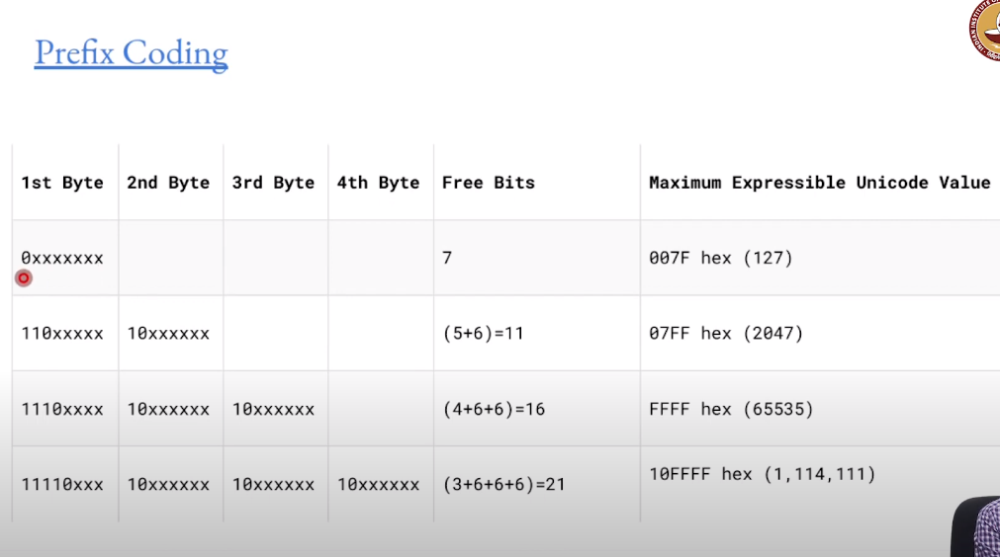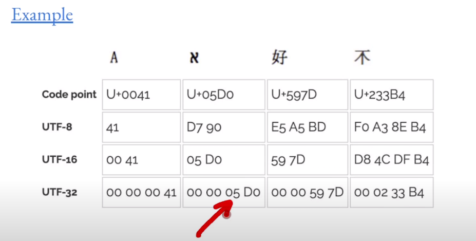

big codepoints are stored in utf-8 using prefix-coding

> UTF 8 and UTF 16 are variable length encodings
>
> UTF 32 is fixed length encoding, easy to interpret, but big file size

**UTF-8**

> Use 8 bits for most common characters ASCII
>
> All other characters can be encoded based on prefix encoding More
> difficult for text processor-
>
> First check prefix
>
> Linked List through chain of prefixes possible still more efficient
> for majority of documents
>
> Most common encoding used today

**Markup**

A way to specify how to render the document. The style of the document,
not the content.

> Content vs Meaning Types of Markup
>
> XHTML

**Content**

Markup is a way of using cues or codes in the regular flow of text to
indicate how text should be displayed.

Markup is very useful to make the display of text clear and easy to
understand.

**TypesofMarkup**

> **WYSIWYG** - what you see is what you get - directly format output
> and display embed codes not part of regular text, specific to editor
>
> **Procedural**
>
> Details on how to display
>
> eg→ change font to large, bold, skip 2 lines, etc **Descriptive** -
> focus on what content means instead of how it looks
>
> eg→ This is a \<title\>, this is a \<heading\>, this is a
> \<paragraph\>

**Examples**

> MS Word, Google Docs, etc
>
> user inteface focus on appearance and not meaning WYSIWYG direct
> control over styling
>
> often leads to complex formatting and loss of inherent meaning
> **LaTeX,HTML,nroff,groff,troff**
>
> focus on meaning
>
> more complex to write and edit not WYSIWYG

**SemanticMarkup**

> Content vs Presentation Semantics :
>
> Meaning of the text
>
> structure or logic of document

**Notes**

TeX, Nroff, Troff, Groff, PostScript Procedural Markup as you have to
mention what to do HTML, Markdown → descriptive markup as you tell what
the content is

**HTML**

> first used by Tim Berners Lee at CERN
>
> SGML Standard Generalized Markup Language Strict definitions on
> syntax, structure, validity
>
> HTML meant for browser interpretation
>
> very forgiving → loose validity checks best effort to display

**Tags**

> paired tags
>
> \< \> are used for tags
>
> closing tags have / before name
>
> Location specific tag: \<DOCTYPE\>only at top of doc Case insensitive
>
> Some self-closing tags, they have format: \<tagname/\>

**PresentationvsSemantics**

> strong vs b
>
> strong is logical markup
>
> b is presentational markup

**HistoryofHTML**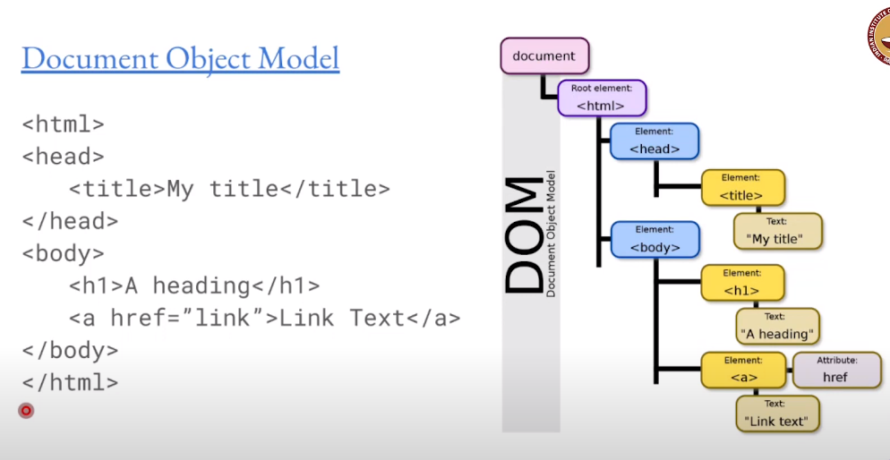

> SGML based
>
> 1989 HTML original 1995 HTML 2
>
> 1997 HTML 3, 4
>
> XML (extensible markup language) based XHTML 1997 to 2010
>
> HTML5
>
> first release 2008
>
> W3C recommendation 2014

**HTML5**

> block elements \<div\> Inline elements \<span\>
>
> Logical Elements \<nav\>, \<footer\> Media: \<audio\>, \<video\>
>
> Remove 'presentation only' tags like \<center\>
>
> \<font\>

**DocumentObjectModel(DOM)**

The nested markup code gives rise to a tree of document objects.

> Tree structure representing the logical layout of the document Direct
> manipulation of the tree is possible
>
> Appilcation programming interfaces APIs canvas
>
> offline
>
> web storage drag and drop
>
> Javascript primary means of manipulating CSS used for styling

**Notes**

> List (like this) formed using ul/ oltags ul→ unordered (bulleted
> lists)
>
> ol→ ordered (numbered lists)
>
> the style of the list (which bullet / numbering system to use) can be
> changed
>
> Regardless of style of list, each list item is marked using litag
> Checkbox → \<input type="checkbox" /\>
>
> Text field → \<input type="text" /\>
>
> Alt attribute of imgtag is shown when image cant be loaded, or for
> screen readers Horizontal line (rule) can be created using hrtag
>
> controlsattribute in audio or video tag is used to show UI controls to
> play/pause/ change volume etc &copy;used to show copyright symbol
>
> 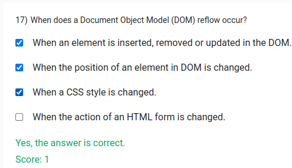 style="width:5.1378in;height:2.97013in" />A reflow on an element
> recomputes the dimensions and position of the element, and it also
> triggers further reflows on that element's children, ancestors and
> elements that appear after it in the DOM. Then it calls a final
> repaint.

**MarkupvsStyle**

> Markup tells the logical structure of the document Style tells how the
> document should look

**SeparationofStyling**

> Style hints in separate blocks separate files included Themes possible
>
> Style sheets - specify presentation information
>
> Cascading Style Sheets CSS allow multiple definitions, latest takes
> precedence

**Notes**

> global selector in CSS \*selects all tags color can be provided by:
>
> color name eg white, black, tomato hexcode eg, \#ffffff
>
> rgb or rgba functions comments in CSS use/\* ... \*/syntax
>
> Responsive Website Adapt to changes in screen sizes CSS precedence
> Inline Internal Extrenal

**InlineCSS**

> Directly add style to a tag (scoped) Example:
>
> \<h1 style="color: blue;text-align: center;"\>A heading\</h1\>

**InternalCSS**

> Embed inside \<head\>tag example:
>
> \<style\>
>
> body{
>
> background-color: linen; }
>
> h1{
>
> color: maroon; margin-left: 40px;
>
> } \</style\>

this will apply the style to all h1 tags in body

**ExternalCSS**

> Extract common content for reuse Multiple CSS files can be included
>
> Latest definition of style takes precedence

**ResponsiveDesign**

> Mobile and Tablets have smaller screens different form factors
>
> adapt to screen - respond
>
> CSS control styling HTML controls content

**Bootstrap**

> CSS framework, originated from twitter standard styles for various
> components
>
> buttons forms icons
>
> mobile first: highly responsive layout

**Javascript**

> interpretted language brought into the browser
>
> not really related to java in any way - formally ECMAscript
> programming ability inside website
>
> not part of the core presentation requirements

**Notes**

> CSS shorthand properties are properties which combine multiple
> properties into one. the value of the properties takes multiple space
> separated values corresponding to each of the properties.
>
> example → border, margin, padding
>
> For conflicting styles, the order in which the CSS files are loaded,
> the CSS styles are defined are all important HTML attribute order is
> not important

The \<thead\>tag is used to group header content in an HTML table.

The \<thead\>element is used in conjunction with the
[\<tbody\>](https://www.w3schools.com/tags/tag_tbody.asp)and
[\<tfoot\>](https://www.w3schools.com/tags/tag_tfoot.asp)elements to
specify each part of a table (header, body, footer).

Browsers can use these elements to enable scrolling of the table body
independently of the header and footer. Also, when printing a large
table that spans multiple pages, these elements can enable the table
header and footer to be printed at the top and bottom of each page.

**Note:** The \<thead\>element must have one or more
[\<tr\>](https://www.w3schools.com/tags/tag_tr.asp)tags inside.

The \<thead\>tag must be used in the following context: As a child of a
[\<table\>](https://www.w3schools.com/tags/tag_table.asp)element, after
any [\<caption\>](https://www.w3schools.com/tags/tag_caption.asp)and
[\<colg<u>rou</u>p\>](https://www.w3schools.com/tags/tag_colgroup.asp)elements,
and before any
[\<tbody\>,](https://www.w3schools.com/tags/tag_tbody.asp)
[\<tfoot\>](https://www.w3schools.com/tags/tag_tfoot.asp), and
[\<tr\>](https://www.w3schools.com/tags/tag_tr.asp)elements.

**Tip:** The \<thead\>, \<tbody\>, and\<tfoot\>elements will not affect
the layout of the table by default. However, you can use CSS to style
these elements (see example below)!

**Style**

> nth-child(even)- only even child elements example:
>
> tr:nth-child(even){
>
> background-color: lightgray; }

to make table rows background-color alternating

tag → using name of tag class → using dot .

id → using hash \#

**RelationalSelectors**

> children (direct child) descendant (child of child of ....)

**Descendant**

> form input { ...
>
> }

all input descendants of form are selected

**Child**

> form \> input { ...
>
> }

only direct children are selected

**PseudoClassSelectors**

Based on state / structure of HTML

> hover → when mouse is hovered
>
> nth-child(...) → select the child which evaluate true to the
> expression ...

Example:

> form \> input:hover{}

**PseudoElementSelectors**

> use double colon :: Example:
>
> form p::first-letter{}

apply style to first letter of each p inside form

> input\[x="y"\]{
>
> }

apply style to all input tags who has attribute x with value y \<input
x="y"\>

**References**

[<u>Pseudo-Classes</u>](https://developer.mozilla.org/en-US/docs/Web/CSS/Pseudo-classes)
[<u>Pseudo-Elements</u>](https://developer.mozilla.org/en-US/docs/Web/CSS/Pseudo-elements)

[<u>https://getbootstrap.com/</u>](https://getbootstrap.com/)

**Model-View-Controller**

> Model Stores data and how to access it View → display data, UI
>
> Controller Connect m and v, control data flow

MVC origins in smalltalk-80 language from xerox PARC

**Separationofresponsibilities** - abstraction → roots in OO GUI
development

**RunningExample:StudentGradebook**

**InputData**

**formodel→**

> student list course list
>
> student-course marks

**Views:**

> marks for individual students summary of course histograms

**Controller**:

> add new students add new courses modify marks

**Notes:**

> Smalltalk-80 is dynamically typed, OO, programming language View
> responsible for user interaction with application

**Views**

> User interface User interaction

**Userinterface**

> screen audio
>
> vibration (haptics)

**Userinteraction**

> keyboard / mouse
>
> touchscreen
>
> spoken voice
>
> custom buttons
>
> determined by hardware constraints
>
> different target devices possible
>
> user-agent information useful to identify context **!**
>
> may not be under designer control

**TypesofViews**

> Fully static
>
> Partly Dynamic Wikipedia) Mostly Dynamic Amazon)

**Output**

> HTML most commonly used - direct rendering Dynamic images
>
> JSON/XML machine readable

" View is any representation useful to another entity (human/machine)"

**Userinterfacedesign**

> design for interaction with user goal -
>
> simple - easy for user to understand and use efficient - user achieves
> goal with minimum effort
>
> aesthetics - what looks good accessibility

**SystematicProcess**

> functionality requirement gathering - what is needed User and Task
> Analysis - user preference, tasks needs Prototyping - wireframes,
> mockups
>
> testing - user acceptance, usablity, accessibility

**Guidelines/Heuristics**

> Jakob Nielsen's Heuristics for design
> [<u>website</u>](https://www.nngroup.com/articles/ten-usability-heuristics)

**10Guidelines:**

**\#1:Visibilityofsystemstatus**

**Thedesignshouldalwayskeepusersinformedaboutwhatisgoingon,throughappropriatefeedbackwithinareasonableamountof**
**time.**

**\#2:Matchbetweensystemandtherealworld**

**Thedesignshouldspeaktheusers'language.Usewords,phrases,andconceptsfamiliartotheuser,ratherthaninternaljargon.**
**Followreal-worldconventions,makinginformationappearinanaturalandlogicalorder.**

**\#3:Usercontrolandfreedom**

**Usersoftenperformactionsbymistake.Theyneedaclearlymarked"emergencyexit"toleavetheunwantedactionwithouthavingto**
**gothroughanextendedprocess.**

**\#4:Consistencyandstandards**

**Usersshouldnothavetowonderwhetherdifferentwords,situations,oractionsmeanthesamething.Followplatformandindustry**
**conventions.**

**\#5:Errorprevention**

**Gooderrormessagesareimportant,butthebestdesignscarefullypreventproblemsfromoccurringinthefirstplace.Either**
**eliminateerror-proneconditions,orcheckforthemandpresentuserswithaconfirmationoptionbeforetheycommittotheaction.**

> There are two types of errors: slips and mistakes. Slips are
> unconscious errors caused by inattention. Mistakes are conscious
> errors based on a mismatch between the user’s mental model and the
> design.

**\#6:Recognitionratherthanrecall**

**Minimizetheuser'smemoryloadbymakingelements,actions,andoptionsvisible.Theusershouldnothavetoremember**
**informationfromonepartoftheinterfacetoanother.Informationrequiredtousethedesign(e.g.fieldlabelsormenuitems)should**
**bevisibleoreasilyretrievablewhenneeded.**

**\#7:Flexibilityandefficiencyofuse**

**Shortcuts—hiddenfromnoviceusers—mayspeeduptheinteractionfortheexpertusersuchthatthedesigncancatertoboth**
**inexperiencedandexperiencedusers.Allowuserstotailorfrequentactions.**

**\#8:Aestheticandminimalistdesign**

**Interfacesshouldnotcontaininformationwhichisirrelevantorrarelyneeded.Everyextraunitofinformationinaninterface**
**competeswiththerelevantunitsofinformationanddiminishestheirrelativevisibility.**

**\#9:Helpusersrecognize,diagnose,andrecoverfromerrors**

**Errormessagesshouldbeexpressedinplainlanguage(noerrorcodes),preciselyindicatetheproblem,andconstructivelysuggesta**
**solution.**

**\#10:Helpanddocumentation**

**It’sbestifthesystemdoesn’tneedanyadditionalexplanation.However,itmaybenecessarytoprovidedocumentationtohelpusers**
**understandhowtocompletetheirtasks.**

**GeneralPrinciples:**

> Consistency
>
> Simple and minimal steps Simple language
>
> minimal and aesthetically pleasing

**Tools**

**Wireframes**

> Visual guides to represent structure of web page information design
>
> navigation design user interface design

**lorem** **ipsum:**

fake latin text that is only meant as a text placeholder to show how the
text content would look without distracting the design by seeming to be
actual text.

**tools** **for** **wireframes:**

> [<u>LucidChart</u>](https://www.lucidchart.com/pages/wireframe) Adobe
> XD Figma

**ProgrammaticHTMLgeneration:PyHTML**

> Composable functions - each function generates a specific output
> Example:
>
> to generate a h1 heading: function should return \<h1\>text of
> heading\</h1\>

Example of pyhtml:

> import pyhtml as h t = h.html(
>
> h.head(
>
> h.title('Test Page') ),
>
> h.body(
>
> h.h1('This is a title'), h.div('This is some text'),
> h.div(h.h2('inside title'),
>
> h.p('some text in a paragraph')) )
>
> ) print(t.render())

More complex HTML

> def f_table(ctx): return (tr(
>
> td(cell) for cell in row
>
> ) for row in ctx\['table'\])

**Templates:**

> Standard template text Placeholders / variables
>
> basic /very limited programmability examples:
>
> python inbuilt string templates - good for simple tasks jinja2 used by
> flask
>
> genshi mako

**Pythonstringtemplate**

> from string import Template
>
> t = Template('\$name is the \$job of \$company')
>
> s = t.substitute(name='Tim Cook', job='CEO', company='Apple Inc.')
> print(s)

prints "Tim Cook is the CEO of Apple Inc."

**Jinja**

> ties in closely with flask
>
> template functionality with detailed API
>
> templates can generate any output, not just HTML

Example:

> from jinja2 import Template
>
> t = Template("Hello {{ something }}!")
> print(t.render(something="World"))
>
> t = Template("My favourite numbers:  {{ n }}
> " "") print(t.render())

will print: Hello World!

My favourite numbers: 1 2 3 4 5 6 7 8 9

**Accessibility**

> Various forms of disability or impairment Vision
>
> Speech Touch
>
> Sensor-Motor
>
> Can a page be accessed by people with impairments? How can the
> accessibility of a page be improved?

[<u>World Wide Consortium W3C</u>](https://w3.org/) - accessibility
guidelines

> [<u>guidelines</u>](https://www.w3.org/WAI/fundamentals/accessibility-principles)

**Standards**

Interplay between many components of a page

> Web content: HTML, images, scripts, etc
>
> User-agents: desktop browser, mobile browser, speech-oriented browser,
> assistive devices Authoring tools: text editor, word processor,
> compiler

**Principle-Perceivable**

> Provide text alternatives for non-text content
>
> Provide captions and other alternatives for multimedia
>
> Create content that can be presented in different ways, including by
> assistive technologies, without losing meaning. Make it easier for
> users to see and hear content.

**Principle-Operable**

> Make all functionality available from the keyboard give users enough
> time to read and use content
>
> do not use content that causes seizures or physical reactions help
> users navigate and find content
>
> make it easier to use inputs other than keyboard

**Principle-Understandable**

> Make text readable and understandable
>
> Make content appear and operate in predictable ways Help users avoid
> and correct mistakes

**Principle-Robust**

> Maximize compatibility with current and future user tools.

**Examples:**

> Use aria-describedby attribute

**Notes**

> {{ }} are variable interpolation
>
> % % are blocks
>
> {# \#} are comments in jinja2

**Jinja2**

> if \_\_name\_\_ == '\_\_main\_\_': main()

only runs main if its run directly (not importted)

**stringformatter**

> string = "hello {name}" string.format(name="Sayan"))
>
> string = "hello {}" string.format("Sayan"))

**specifiers:**

> +for showing sign of number always \`a="this is {p:+}"
>
> dfor decimal value xfor hexadecimal value

**PersistentStorage**

Example: Gradebook

> students: ID, name, address courses: ID, name, department, year
>
> StudentCourse Relationship - which students are registered for which
> courses

**Spreadsheets**

> arbitrary data organized into rows and columns operations defined on
> cells or ranges
>
> multiple inter-linked sheets within single spreadsheet

**Relationships?**

> student - course ?
>
> separate entry with full details - student name, id, address, course
> id, name, department, etc ? NO redundant
>
> Create another table joining students and courses only ID required
>
> relation specified with keys

**MemoryDataStructures**

> lists tuples
>
> dictionaries objects

**KEYS**

used to uniquely identify elements

> data entry errors less likely duplicates not a problem - unique key

**OBJECTS**

> class Student:
>
> idnext = 0 \# Class Variable def \_\_init\_\_(self, name):
>
> self.name = name
>
> self.id = Student.idnext Student.idnext = Student.idnext + 1
>
> auto initialise ID to ensure unique functions to set/get values

**PERSISTENTSTORAGE?**

> in memory data structures lost when server shut down or restarted save
> to disk? structured data?
>
> python pickle module (serialising data) csv - comma separated values
>
> tsv - tab separated values
>
> Essentially same as spreadsheets - limited flexibility

**ADVANTAGESANDDISADVANTAGESOFSPREADSHEETS**

**ADVANTAGES:**

> natuarally represent tabular data extension, adding fields easy
> separate sheet for relationships

**DISADVANTAGES**

> lookups, cross-referencing harder than dedicated database stored
> preocedures - limited functionality
>
> atomic operations - no clear definition

**RELATIONALDATABASES**

> Data strored in tabular format
>
> columns of tables: fields(name, address, departements, etc) row of
> tables: individual entries (student1, student2, etc)

**Unstructureddatabases(NoSQL)**

> easily add/change fields arbitrary data
>
> noSQL
>
> mongoDB couchDB
>
> Flexible, but potential loss of validation

**Relationships**

> joining two tables together using their unique ids → expresses
> relationships between them

**TypesofRelationships**

> **Onetoone**
>
> one student has one roll number
>
> one roll number uniquely identifies one student
>
> example: assign unique message-ID to each email in inbox
> **Onetomany(manytoone)**
>
> one student stays in only one hostel one hostel has many students
>
> example: save emails in folders, one email is in only one folder, but
> one folder has multiple emails
>
> **Manytomany**
>
> one student can register for many courses one course can have many
> students
>
> example: assign labels to emails, one email can have multiple labels,
> and vice versa

**Diagrams**

> Entity Relationship ER diagram
>
> Unified Modeling Language UML
>
> Class relation diagram

**Crowfootnotation-**

[<u>https://vertabelo.com/blog/crow-s-foot-notation/</u>](https://vertabelo.com/blog/crow-s-foot-notation/)

**SQL**

**KEY**

> **PrimaryKey** - important for fast access on large databases, unique
> attribute which cannot be null **ForeignKey** - connect to different
> table Relationships

**Queries**

> Retrieve data from database
>
> eg- find all students with name beginning with A find all courses
> offered in 2021

**StructuredQueryLanguage(SQL)**

> english like, but structured quite verbose
>
> specific mathematical operations -inner join
>
> 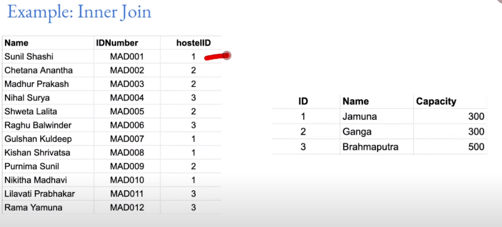 style="width:6.43007in;height:2.91802in" />outer join Example inner
> join:

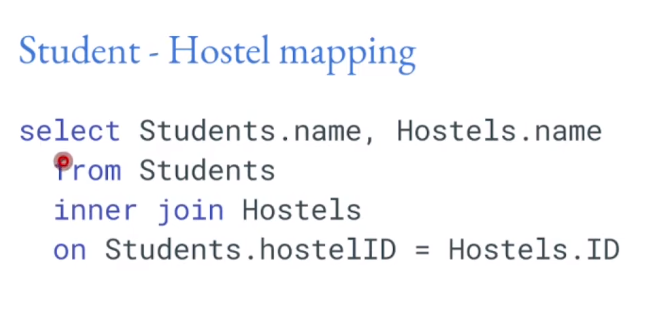

**CartesianProduct**

> N entries in table 1 M entries in table 2
>
> M x N combinations - filter on them Powerful SQL Queries can be
> constructed

**Example-findstudentsinCalculus**

> find id number for course
>
> look up studentcourses table to find all entries with this coures id
> look up students to find names of students with those ids
>
> select s.name from Students s
>
> join StudentsCourses sc ON s.IDNumber = sc.studentID join Courses c ON
> c.ID = sc.courseID
>
> where c.name = 'Calculus'

**Notes**

> 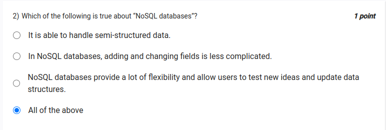 style="width:6.43007in;height:2.15725in" />Single line comment in SQL
> -- this is a comment
>
> **TRUNCATE** command deletes all data from table, but schema is
> preserved **DROP** command drops the entire table along with data and
> schema
>
> **DROP** cannot be rolled back
>
> **NOSQL** databases dont have to adhere to ACID properties LIKEkeyword
> used to check likeness of strings in SQL, example:

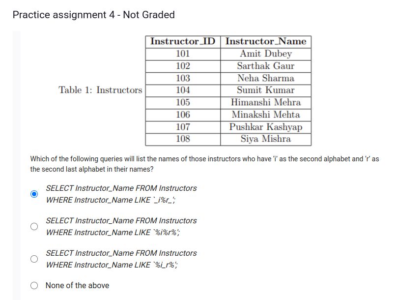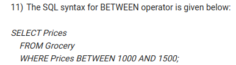

> here %refers to multiple characters, \_refers to single character
>
> to find highest or lowest of something, sort by attribute, then limit
> 1
>
> VALID JOINS
>
> INNER JOIN FULL JOIN LEFT JOIN RIGHT JOIN
>
> **GROUPBY** command used to group results using one (or more)
> attributes - [<u>group by</u>](https://www.guru99.com/group-by.html)

**MVCorigins**

> collection of design patterns
>
> originally introduced in GUI design of smalltalk many variations

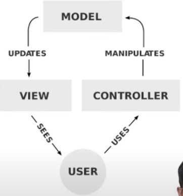

**requestsandresponses**

> example: dynamic web page
>
> links: clickable to select various options clicking a link triggers
> different behaviours

Web is based completely on requests and responses

> clients make requests server sends responses
>
> basic requests: clicking on link / URL HTTP GET
>
> More complex request: form submissions: HTTP POST

**CRUD**

> **CREATE**
>
> create a new entry must not already exist
>
> check within database to avoid conflicts
>
> mention mandatory vs optional fields (name, address, mobile
> number,...) **READ**
>
> get a list of students
>
> summarisse number of students, age distribution, geographic locations
> plot histograms of marks
>
> etc **UPDATE**
>
> change of address update marks
>
> change start date of course **DELETE**
>
> remove graduated students delete mistaken entries unenroll student
> from course

**CRUD CREATE,READ,UPDATE,DELETE**

> lifecycle of data
>
> orginally in context of database operations, nothing to do with the
> web reflects cycle of data models
>
> databases optimized for various combinations of operations
>
> read-heavy: lots of reading, very little writing or creating
> write-heavy: security archive logs

**API-applicationprogramminginterface**

> standardized way to communicate with a server
>
> client only needs to know API not how the server implements the
> database for example CRUD is a good set of functionality for a basic
> API
>
> usually considered the first level API to implement a web application
> Deals only with the data model life cycle - other control aspects
> possible

**Controllers-groupofactions**

**ActionsvsControllers**

> CRUD etc are a set of actions other actions:
>
> send email update logs
>
> send alert on wh atsapp / telegram
>
> can actions be grouped together logically? yes using **controller**

**Summary:**

> **actions** : interactions between view and model **controller**:
> group actions together logically **api**: complex set of capabilities
> of server interaction through **httprequests**
>
> http **verbs** used to convey meanings

**Ruleofthumbs:**

> should be possible to change views without the model ever knowing
>
> should be possible to change underlying storage of model without views
> ever knowing controllers / actions should generally NEVER talkt to a
> database directly
>
> In practise:
>
> views and controllers tend to be more closely interlinked than with
> models more about a way of thinking than a specific rule of design

**Notes**

> URL is subset of URI URN is subset of URI

**Routesandcontrollers**

**webapplicationsarestateless**

> so we cant incorporate state in the server so we use url to indicate
> state
>
> so we use routes

Client server model

> stateless - does not know state of client
>
> must be ready to respond to whatever the client requests without
> assuming anything about the client requests sent through http protocol
>
> use variant of the get,post (verbs) to convey **meaning**
>
> use url (uniform resource locator) structure to convey **context**

**Routing-**

mapping urls to actions

**Pythondecorators**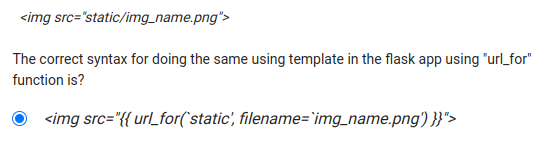

> add extra functionality on top of a function "@" - decorators before
> function name
>
> effectively **functionofafunctionthatreturnsafunction** take the inner
> function as an argument
>
> return a function that does something before calling the inner
> function

**basicroutinginflask**

> from flask import Flask app = Flask(\_\_name\_\_)
>
> @app.route('/') def home():
>
> return "hello world!"

@app.route('/')is decorator, which makes flask route the path '/' to
that method

**Notes**

> WSGI web server gateway interface
>
> The Web Server Gateway Interface is a simple calling convention for
> web servers to forward requests to web applications or frameworks
> written in the Python programming language.
>
> **Werkzeug** is a WSGI toolkit that implements requests, response
> objects, and utility functions. Flask default port is **5000**
>
> while routing, functions need to have unique name, else flask throws
> assertion error
>
> enctype is an attribute in html form elements, which speficies how to
> encode form data. only works if method is POST

**APIDesign**

**DistributedSoftwareArchitecture**

> server and clients
>
> standard protocols needed for communication assumptions:
>
> server always on?
>
> server knows what client is doing? client authentication
>
> network latency

**Theweb**

> client and server mostly are apart different networks, latencies,
> quality authentication not core part of protocol state -
>
> server does not know state of client client does not know state of
> server

**REST**

> roy fielding phd thesis
>
> representational state transfer
>
> take account limitation of web provide guidelines or constraints

**ConstraintsofREST:**

> client server architecture
>
> stateless - server cannot assume state of client and vice versa
> layered system
>
> traffic goes through network to load balancer, auth server, backends,
> etc. server does not know how many layers and what they are
>
> response can be cached at any of those layers cacheablity - response
> can be sent from cache uniform interface -
>
> client and server interact in a uniform and predictable manner server
> exposes resources
>
> (optional) code on demand
>
> server can extend client functionality using javascript / java applets

**REST**

state information between client and server explicitly transferred with
every communication

**Sequence**

> client accesses a resource identifier from server usually URI superset
> of URL
>
> typically start from home page of app no initial state assumed
>
> resource operation specified as part of access if http then get, post,
> etc
>
> not fundamentally tied to protocol server responds with new resource
> identifier
>
> new state of system, new links to follow, etc

**stateofinteractiontransferredbackandforth**

**HTTP**

> one possible protocol to carry REST messages use the http verbs to
> indicate actions standardize some types of functionality
>
> GET retrieve rep of target resources' state
>
> POST enclose data in request: target resource 'processes' it PUT
> create a target resource with data enclosed
>
> DELETE delete target resource

**idempotentoperations**

> repeated application of the operation is safe example: GET as its read
> only
>
> PUT is also idempotent as you can only put it once, next times may
> give error DELETE (with id) is idempotent
>
> POST is not idempotent

**CRUD**

> crud is database operations
>
> typically a common set of operations needed in most web apps good
> candidate for REST based functionality
>
> **REST! CRUD** but they do work well together

**Dataencoding**

> Basic HTML for simple responses XML structured data response
>
> JSON simpler form of structured data

data serialisation for transferring complex data types over text based
format

**JSON**

> javascript object notation nested arrays and objects
>
> serialize complex data structures like dictionaries, arrays, etc

**APIdatatransferformat**

> input to API text HTTP
>
> output: complex data types JSON, XML, YAML, etc json most common
>
> DIfferent from internal server representation different from final
> view presentation

**YAML**

> yet another markup language - common alternative, especially for
> documentation and configuration

**OpenAPI**

> way of formalizing/standardizing API documentation

**API**

> purpose: information hiding - neither server nor client should know
> details of implementation on other side unbreakable contract - should
> not change - standardized
>
> version may update with breaking changes

**Documentation**

> highly subjective - some are better than others at documenting
> incomplete - what one finds enough, other may find insufficient
> outdated
>
> human language specific

**DescriptionFiles**

> machine readable - has very specific structure eanable automated
> processing
>
> boilerplate code mock servers
>
> Example: assembly language is a version of the programming language of
> computers that is both machine and human readable structured so it can
> be compiled
>
> versus: english language specification which needs someone to write
> code

**OpenAPIspecification(OAS)**

> **vendor-neutral** format for **HTTP-based** remote API specification
> Does not aim to describe all possible APIs
>
> efficiently describe the common use cases
>
> orginally developed as Swagger - evolved from Swagger 2.0 Current
> version: OAS3

**ConceptsofAPIdocumentation**

> describe in YAML
>
> specific structure to indicate overall information, paths, schemas etc

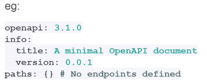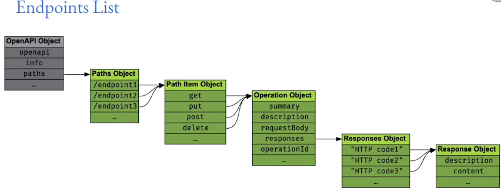

**Bestpractices**

> design first vs code first - always prefer design first single source
> of truth:
>
> the structure of the code should be derived from the OAS or spec
> should be derived from code
>
> minimize chances of code and documentation diverging source code
> version control
>
> openAPI is ... open public documentation better to identify problems
> automated tools, editors make use of them

**BACKENDSYSTEMS**

**MemoryHierarchy**

**Typeofstorageelements:**

> on chip registers: 10s-100s of bytes, superfast (static ram) SRAM
> (cache): 0.1 1MB , very fast DRAM (dynamic ram): 0.1 10GB or much more
> , fast
>
> Solid State disk SSD flash 1 100GB, non-volatile, medium Magnetic Disk
> HDD 0.1 10TB, non volatile, slow
>
> optical, magnetic, holographic etc

**StorageParameters**

> **Latency**: time to reaad first value from a storage location (lower
> is better) Register SRAM DRAM SSD HDD
>
> **Throughput**: number of bytes/second that can be read (higher is
> better) DRAM SSD HDD (registers and SRAM have limited capacity)
>
> **Density**: number of bits stored per unit area / cost (higher is
> better) HDD SSD DRAM SRAM registers

**ComputerOrganization**

> cpu has as amny resgisters as possible backed by l1,l2,l3 cache (sram)
>
> backed by several GB of dram working memory backed by ssd for high
> throughput
>
> backed by hdd for high capacity backed by long-term storage, backup

**ColdStorage**

> backups and archives
>
> huge amount of data not ready very often
>
> can tolerate high read latency
>
> amazon galcier, google, azure cold/archive storage classes high
> latency of retrieval : upto 48 hrs
>
> very high durability very low cost

**impactonapplicationdevelopment**

> plan the storage needs based on application growth
>
> speed of app determined by types of data stored, how stored
>
> some data stores are more efficient for some types of read/write
> operations

developer must be aware of choices and what kind of database to choose
for a given application

**DataSearch**

**bigohO()notation**

> used in study of algorithm complexity
>
> rough approximation: order of magnitude, approximately, etc O 1
> constant, not depend on n
>
> O(log n): logarithmic in input size
>
> O N
>
> O Nⁱ) - polynomial O(iⁿ) - exponential

**Searchingforelementinmemory**

> unsorted data in linked list → linear O N
>
> sorted data in array (random access) → logarithmic **O(logN**) using
> **binary** **search**

**Problemswitharrays:**

> size must be fixed ahead of time
>
> adding new entries require resizing, can try oversize but eventually
> overflow
>
> maintaining sorted order O N
>
> find location to insert
>
> move all further elements by 1 to create gap insert
>
> deleting O N
>
> find location, delete
>
> move all entries down by 1 step

**Alternatives:**

> Binary search tree → maintaining sorted order is easier: growth of
> tree
>
> Self balancing binary trees BST can easily tilt to one side and grow
> downwards, Red-black, AVL trees, B trees, more complex but reasonable
>
> Hash tables
>
> compute an index for an element O 1
>
> hope the index for each element is unique, difficult but doable using
> collision control techniques

**DatabaseSearch**

> databases are mostly tabular tables with many columns
>
> want to search quickly on some columns maintain INDEX of columns to
> search on
>
> store a sorted version of column
>
> needs columns to be comparable: integer, short string, date/time, etc
> long text fields are not good for index
>
> binary data not good
>
> example: mysql database uses b-trees and hash indexes

**Indexfriendlyqueries**

> string searches whose first letters are provided and not globbed

**multicolumnindices**

> i1,i2,i3 compound index on 3 columns: first sorted on i1, then i2,
> then i3
>
> all values with same i1 will be sorted on i3, etc
>
> index friendly using AND command on index comparisons, not OR

**Hashindex:**

> only used in in-memory tables
>
> only for equality comparisons, not range or comparison does not help
> with ORDER BY
>
> partial key prefixes cannot be used but VERY fast

**Queryoptimization**

> database specific

**SQLvsNoSQL**

**SQL-structuredquerylanguage**

> used to query databases that have structure
>
> could also be used for CSV files, spreadsheets, etc closely tied to
> RDBMS relational databases
>
> columns/ fields
>
> tables of data hold relationships
>
> all entries in a table MUST have same set of columns tabular databases
>
> efficient indexing possible - use specified columns storage
> efficiency - prior knowledge of data size

**Problemswithtabulardatabases**

> structure can also be problem
>
> all rows in table must have same set of columns

**Alternatewaystostoredata:Documentdatabases**

> **freeform(unstructured)documents** typically json encoded
>
> still structured, but each document has own structure examples:
> mongoDB, amazon DocumentDB
>
> **key-valuepairs**
>
> python dictionary, c++ orderedmap, etc = dictionary/hash table map a
> key to a value
>
> store using search trees or hash tables
>
> very efficient lookup, not good for range type queries examples:
> redis, berkeleyDB, memcached
>
> often used alongside other databases for 'in-memory' fast queries
> **columnstore** -
>
> traditional RDBMS store all values of a row together on disk
> retrieving all entries of a given row is very fast
>
> instead, store all entries in a column together
>
> retrieve all values of a given attribute is very fast example:
> casablanca, HBase
>
> **Graphs**
>
> networks, etc, graph oriented relationships
>
> different degrees (no. of outgoing edges), weight of edges, nodes, etc
> path finding more important than just search
>
> connections, knowledge discovery examples: neo4j, amazon neptune
>
> **Timeseriesdatabases**:
>
> very application specific: store some metric or values as a function
> of time used for log analysis, performance analysis, monitoring
>
> queries - how many hits between T1 and T2, average number of requests
> per second, country from where maximum requests came in past 7 days
>
> typical RDBMS completely unsuitable , and other alternatives too
> examples: RRDtool, influxDB, prometheus
>
> search: elasticsearch, grafana

**NoSQL**

> started out as alternative to SQL
>
> but SQL is just a query language, can be adapted fora y, including
> from a document store or graph not-only-sql
>
> additional query patterns for other types of data stores

**ACID**

> tracactions- core principle of databases
>
> ACID
>
> atomic consistent isolated durable
>
> Many NoSQL databases sacrifise some part of ACID (example: eventual
> consistency instead of consistency) for performance but there can be
> ACID complaint NoSQL databases as well

**WhynotACID?**

> consistency is hard to meet: especially when scaling / distributing
> eventual consistency easier to meet
>
> example: A located in india and B located in US both add C as a friend
> on facebook, order of adding does not matter, temporarily seeing C in
> A's list but not B, or B's list but not A, not a problem
>
> financial transactions absolutely require ACID
>
> consistency is paramount even for splitsecond in case of money

**datastored**

> in memory - fast, does not scale accorss machines disk - different
> data structures, organization needed

**Scaling**

**ReplicationandRedundancy**

> **redundancy**:
>
> multiple copies of same data
>
> often used in connection with backups, even if one fails, other
> survive one copy is still the master
>
> **replication**:
>
> usually in context of performance many not be for purpose of backup
>
> multiple sources of same data, less chance of server overload live
> replicaation requires careful design

**BASEvsACID**

> BASE **b**asically **a**vailable, **s**oft state, **e**ventually
> consistent
>
> eventual consistency instead of consistency - replicas can take time
> to reach consistent state stress on high availability of data

**ReplicationintraditionalDBs**

> RDBMS replication possible
>
> usually server cluster in same data center- load balancing
>
> geographically distributed replication harder, latency constraints for
> consistency

**ScaleupvsScaleout**

> **Scaleup**: traditional approach -
>
> larger machine, more ram, faster network, processor, requires machine
> restart with each scale change **Scaleout**:
>
> multiple servers, harder to enforce consistency, etc - better suited
> to NoSQL/BASE
>
> better suited to cloud model: google, aws, etc provide autometic
> scale-out, cannot do auto-scale-up

**Applicationspecific**

> financial transactions - cannot afford even slightset inconsistency,
> only scale-up possible typical web application - social networks,
> media, eventual consistency is acceptable ecommerce - only the
> financial part needs to go to ACID DB

**Security**

> non mvc app - can have direct SQL queries anywhere
>
> MVC only in controller, but any controller can trigger a DB query

**dangersofqueries:**

> sql injections :
>
> parameters from html taken without validation
>
> validation: are they valid text data, no special characters, other
> symbols, no punctuations or other invalid input, are they the right
> kind of input (text, number, email, date)
>
> validation must be done just before the database query - even if you
> have validation in HTML or javascript, not enough direct http requests
> can be made with junk data
>
> buffer overflows, input overflows - length of inputs, queries
>
> server level issues, protocol implementations - use known servers with
> good track record of security, update all patches possible outcomes:
>
> loss of data - deletion exposure of data (sensitive) manipulation of
> data

**HTTPS**

> secure sockets - secure communciation between client and sever server
> certificate:
>
> based on DNS, has been verified by some trusted third party difficult
> to spoof
>
> based on mathematical properties - ensure very low probablity of
> mistakes match however:
>
> only secures link for data transfer, does not perform validation or
> safety check negative impact on caching of resources like static files
>
> some overhead on performance

**Frontend**

**mechanisms**

> user facing interface
>
> general GUI application on desktop browser based client
>
> custom embedded interface
>
> device/ OS specific controls and interfaces web browser
> standardizations
>
> common conventions among browsers on how to render, what to render
> browser vs native
>
> look and feel
>
> API, interfaces, interactions UI/UX

**webapplications**

> browser based applications: HTML CSS JS html - what to show
>
> css - how to show js - interaction
>
> frontend mechanisms:
>
> how to generate html,css,js? functional reuse, common frameworks,
> server/ client load impliactions security implications

**fullystaticpages**

> all or most pages on site are statically generated - compiled ahead of
> time, not generated at runtime excellent for high performance - server
> just picks up file and delivers
>
> how do you adapt to run-time conditions? user logins, user specific
> informations, time of day, etc → using javascript increasingly
> popular: static site generators
>
> jekyll, hugo, next.js, gatsby

**runtimehtmlgeneration**

> traditional CGI / WSGI based apps python flask,django, ruby on rails
>
> php core concept → server-side run-time generation of HTML wordpress,
> drupal, joomla traditional CMS applications
>
> great flexibility → common layouts, adaptions and themeing easy
> runtime changes, user login, time of day etc easy
>
> server load is bad → every page has to be generated dynamically, may
> involve db hits, cost, speed caching and other technologies can help,
> but complex

**clientload**

> typical web browser: issue req, wait for resp, render HTML, wait for
> user input, most time spent here let client do more, also allow more
> fancy interactions
>
> **client-side-scripting** -
>
> javascript the defacto standard
>
> component frameworks allow reuse, complex interactions serverside
> javascript → nodejs

**tradeoffs** **of** **server** **side** **rendering:**

> server side rendering is very flexible, easier to develop, less
> security issues on client, but load on server is more, more security
> issues on server

**tradeoffs** **of** **static** **sites:**

> cache friendly and very fast but
>
> interaction difficult/impossible, compilation phase for small chagnes,
> require recompile

**tradeoff** **of** **clientside:**

> can combine well with static pages and less load on server but still
> dynamic but more resources neede on client, potential security issues,
> data leakage

**asyncupdates**

**originalweb:**

> client sends request, server responds, client displays
>
> for any update of page- new req sent from client to server, server has
> to respond with complete page html styling etc, client renders that
> page again
>
> potential issues → server load → lots of redundant data to be sent
> each time, server-rendering → more work, slow updates→ load full page,
> rerender

**async**

> update only part of the page → load extra data in the background after
> the main page has been loaded and rendered quick response on main page
> → better user experience
>
> request for update can ask for just minimal data to refresh part of a
> page originally seen as AJAX, now many variants
>
> core idea: refresh part of the document on async queries to server

**DOM**

> document object model
>
> programming interface for web documents
>
> dom is an abstract model (tree structure) of the document object
> oriented allows manipulation like known objects
>
> tightly coupled with javascript in most cases → can also be
> manipulated from other languages

**browserclientoperations**

**minimalrequirement:**

> render HTML
>
> cookie interaction → accept, return cookies from server to allow
> sessions text-mode browsers (lynx, elinks, etc) may not do anyting
> more

**textmodeandaccesibility**

> browse from command line - only text displayed no images, limited
> styling
>
> accessibility: page should not rely on colours or font sizes/styles to
> convey meaning

**pagestyling**

> CSS most popular
>
> difficult in text, accesible browsers - but has many features to help
> even with those proper separtion of HTML and styling gives best
> freedom to browser,user

**interactivity**

> some form of client-side programablity needed js most popular
>
> can interact with basic HTML elements
>
> can also be used independently to create more complex forms
> performance of js depends on browser and choice of scripting engine

**javascriptengines:**

> chrome, chromium,brave,edge : v8 firefox: spidermonkey
>
> safari, olderIE use their own impact:
>
> performance : v8 generally best at presnet
>
> js standarization means difference in engine is less important

**clientload**

> js engines also use cliennt cpu power, complex page layout require
> computation can also use GPU
>
> potential to load cpu

**machineclients**

> client may not always be human
>
> machine end points - typically access APIs
>
> embedded devices post sensor information to data collection sites
> typically cannot handle js, only http endpoints

**alternativestojsonweb**

> runs python on web

**WASM**

> web assembly
>
> binary instruction format targets a stack based VM
>
> sandboxed with controlled asccess to APIs executable format for web
>
> handles high performance execution can translate graphics to OPENGL
> etc

**emcripten**

> compiler framework compile C or C to WASM
>
> potential for craeting high performance code that runs inside browser

**nativemode:**

> file system phone sms
>
> camera object detection etc web payments
>
> using API of js

**clientsidecomputations**

**validation**

> server side validation is essential
>
> but some part can be done on client side

**inbuiltHTML5formcontrols**

> partial validation added by html5 required: mandatory
>
> minlength, maxlength for text min,max for number
>
> type for some types pattern → regex

**CAPTCHA**

> problem - scripts that try to automate web pages
>
> can generate large number of requests in short time - server load
> railway tatkal, cowin etc

solution:

> prove that you are human
>
> limited number of clicks possible per unit time
>
> script on page will generate some token, server will reject requests
> withotut the token

**Sandboxing**

> secure area that JS engine has access to , cannot access files,
> network resources, local storage similar to VM

**overloadandDDOS**

> DoS denial of service many requests to server
>
> server attack: replace some popular Js with bad version, etc

**Security**

**AccessControl**

> access → being able to read/write/modify information
>
> not all parts of application for public access like personal data,
> financial, etc type of access → readonly, read-write, modify but not
> create, etc

**examples:**

> linux file system → owner, group → access your own files, cannot
> modify or even read others can be changed by owner
>
> root or admin or superuser has power to change permissions email → you
> can read your own email
>
> can forward an email to someone else, that is also access
>
> ecommerce login → shopping cart etc visible to only user, financial
> information

**discretionaryvsmandatory**

> **discretionary** → you have control over who you share with,
> forwarding mails, changing file access modes etc possible
> **mandatory** → decisions made by centralized management - users
> cannot even share information without permission, typically in high
> security (like military) systems

**role-basedaccesscontrol**

> access associated with 'role' instead of unique id.
>
> Role is like a class, applicable to multiple users having separate
> unique ids
>
> eg. → student details access should be given to HOD role, and current
> HOD will be given HOD role, and removed when changed
>
> single user can have multiple roles → hod,teacher, cultural advisor,
> etc
>
> **hierarchies** or superset :
>
> HOD Teacher Student
>
> HOD sports club member (no hierarchy here)
>
> rules of roles:
>
> example: HOD can be assigned to only one person at a time,etc

**attributebasedaccesscontrol**

> attribute:
>
> time of day
>
> some attribute of user, example citizenship, age,etc can add extra
> capability over role-based

**policiesvspermissions**

> **permissions**: static rules usually based on simple checks, example
> group based **policies**: more complex conditions possible, combine
> multiple policies
>
> example:
>
> bank employee can view ledger entries ledger access only after 8am on
> working days

**principleofleastpriviledge**

> entitiy should have minimal access required to do the job example:
> linux file system →
>
> user can read system libraries but not write
>
> some files like /etc/shadow not readable by anyone except root
>
> you can install python to local files using venv but not to system
> path benefits:
>
> better security → feweer people with access to sensitive data better
> stability → user cannot accidentally delete important files ease of
> deployment → can create template filesystems to copy

**priviledgeescalation**

> change user or gain an atrribute → **sudo** or **su**
>
> usually combined with explicit logging, extra safety measures, etc
> recommended → do not **sudo** unless absolutely necessary
>
> never operate as root in a linux/unix environment unless absolutely
> necessary
>
> never use su (change user), if needed priviledge, use sudo (same user,
> more priviledge)

**webapps**

> admin dashboards, user access, etc

**enforcing**

> hardware level → security key, hardware token for access, locked
> doors, etc operating system → filesystem access, memory segmentation
>
> application level → db server can restrict access to specific db
>
> web application → controllers enforce restrictions, decorators in
> python used in frameworks like flask

**notes**

> discretionary

**securitymechanisms**

> **obsurity(badidea)**
>
> application listens on non-standard port known only to specific people
> **address**
>
> where are you coming from? host based access/deny controls **login**
>
> username/password provided to each person needing acces (never store
> password directly) **tokens**
>
> access tokens that are difficult/impossible to duplicate
>
> can be used for machine-to-machine authentication without passwords

**HTTPauthentication**

> basic http authentication - enforced by server
>
> 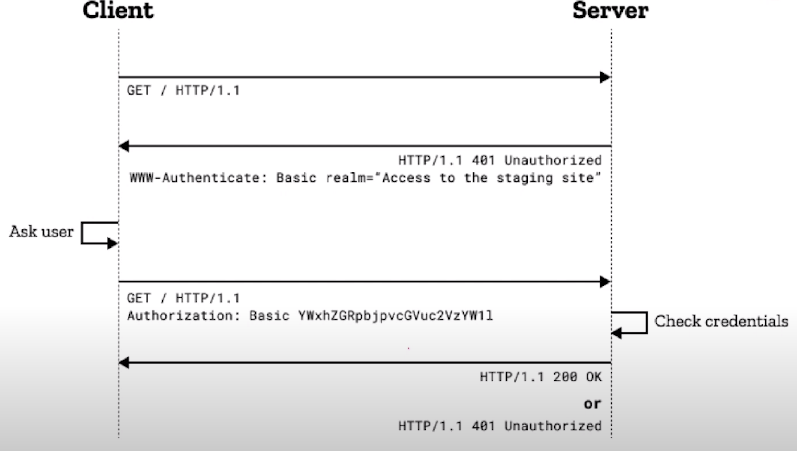 style="width:6.43007in;height:3.63711in" />- server returns
> 401/unauthorized code to client (not 404-not found, 403 forbidden(no
> option to authenticate) - client must respond with access token as an
> extra HEADER in next request

**problems** **of** **http** **authentication**

> username, password effectively sent as plain text (base64 encoding)
> some minimal security if HTTPS used (wiretap is difficult)
>
> password will be seen in cleartext at server
>
> should not be needed -better mechanisms possible no standard process
> for logout

**digestauthentication**

> message digest: cryptographic function → eg, MD5, SHA1, SHA256, etc
> one-way function f(A) B
>
> easy to ccompute B given A, very difficult to compute A given B
>
> can define such one-way functions on strings (string→binary number)

**HTTPdigestauthentication**

> srever provides a 'nonce' (number used once) to prevent spoofing
> client must create a secret value including nonce
>
> example:
>
> HA1 MD5(username:realm:password)
>
> HA2 MD5(method:URI
>
> response MD5 HA1:nonce:HA2
>
> server and client know all parameters above, so both will compute same
>
> any third party snooping will see only final response → cannot extract
> origginal value. nonce used once to prevent replay attacks but here
> still password is stored by server

**clientcertificates**

> cryptographically secure certificates provided to each client
>
> client does handshake with server to exchange information, prove
> knowledge keep cert secure on client end → impossible to reverse and
> find the key

**forminput**

> username and password entered into form
>
> transmitted over link to server (link must be secure HTTPS
>
> GET requests: URL encoded data : very insecure, open to spoofing
>
> POST requests: form multipart data: slightly more secure, still needs
> secure link to avoid data leakage

**requestlevelsecurity**

> one tcp connection
>
> one security check may be sufficient
>
> other network level issues to consider for TCP security without
> connection KeepAlive
>
> each request needs new TCP connection each request needs new
> authentication

**cookies**

>  style="width:6.43007in;height:0.22927in" />server checks some client
> credentials, then 'sets a cookie' ( random number, not possible to
> guess ) header →
>
> client must send back the cookie with each request **server**
> maintains 'sessions' for clients
>
> remembers cookies can set timeouts
>
> delete cookie record to logout **client**
>
> must send cookie with each request

**APIsecurity**

> cookies etc require interactive use (browser) basic auth-pop up window
> not possible in API
>
> API typically accessed by machine clients or other applications
> commandline etc possible, but not used
>
> use token or API key for access
>
> subject to same restrictions: HTTPS, not part of URL, etc

**sessions**

**sessionmanagement**

> client sends multiple requests to
> server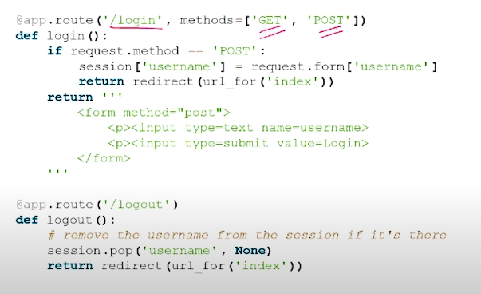 style="width:6.28417in;height:3.83511in" />
>
> save some state information → logged in, choice of bg color, etc
> server customizes responses based on client session information
>
> storage: client-side session (stored in cookie) and server-side
> session (stored on server, looked up from cookie)

**cookies**

> set by server with set-cookie header
>
> must be returned by client with each request
>
> 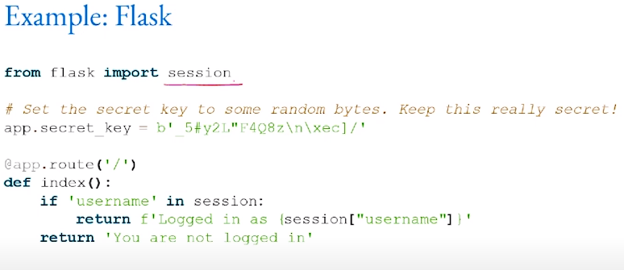 style="width:6.43007in;height:2.78254in" />can be used to store
> information: theme, bg color, font size (no security issues), user
> permissions, username can also be set in cookie but must not be
> possible to alter

**securityissues:**

> user can modify cookie
>
> if someone else gets cookie they can login → remedy: timeout, source
> IP, etc cross-site requests
>
> attacker can create page to automatically submit request to another
> site, if user is logged in on other site wheen they visit attack page,
> with automatically invoke action. verify on server that request came
> from legitimate start point

**serversideinformation**

> maintain client information at server
>
> cookie only provides minimal lookup information not easy to alter
>
> requires persistent storage at server
>
> multiple balckends possible → file storage, database,
> redis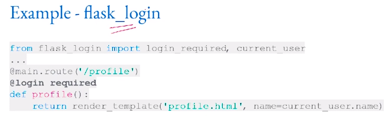 style="width:6.43007in;height:2.26147in" />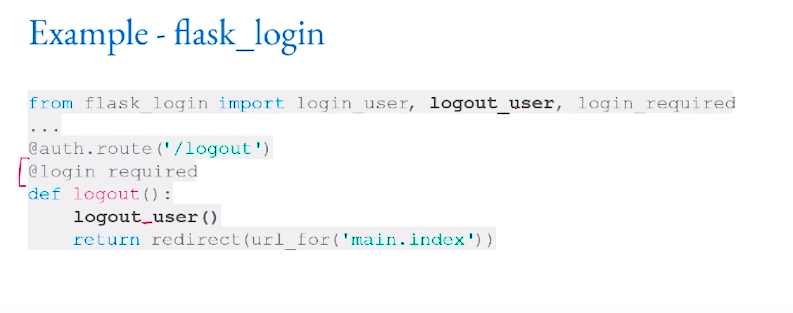 style="width:6.43007in;height:2.53243in" />

**enforceauthentication-**

> some parts of site must be protected
>
> enforce existence of specific token for access to those views views:
> determined by controller
>
> protect access to controller: flask controller → python function
>
> protect function → add wrapper around it to check auth status
> (decorator)

**transmitteddatasecurity**

> assume connection can be 'tapped' attacker should not be able to read
> data
>
> HTTP GET URLs not good → logged on firewalls, proxies, etc
>
> HTTP POST, Cookies, etc : if wire can be made safe, then good enough

**Notes**

> SESSION COOKIES VS PERSISTENT COOKIES
>
> Session cookies do not retain any information on your device or send
> information from your device. These cookies are deleted when the
> session expires or is terminated when the browser window is closed.
> Persistent cookies remain on the device until you erase them or they
> expire.

**HTTPS**

**normalHTTPprocess**

> open connection to srever on fixed network port 80
>
> transmit HTTP request recieve HTTP response

safety of transmitted data is not there:

> can be tapped can be altered

**securesockets**

> set up an 'encrypted' channel between client and server need a shared
> secret → eg long binary string (key)
>
> XOR all input data with key to generate new binary data attacker
> without key cannot derive actual data
>
> how to set up shared secret?
>
> must assume anything on the wire can be tapped what about pre-existing
> key?
>
> secure side channel - send a token by post, SMS, etc

**typesofsecurity**

> channel (wire) security → ensure that no one can tap the channel, most
> basic need for other auth mechanisms, etc
>
> server authentication → how do we know that we are actually connecting
> to correct server and not some other server, DNS hijacking possible,
> server certificates help. common root of trust needed - someone who
> 'vouches for' that server's authenticity client certificate → rare but
> useful - server can require client certificate. used especially in
> corporate intranets.

**httpscertificates**

> chain of trust A issues to B, B issues to C, etc. if you trust a node,
> you trust all its descendants potential problems:
>
> old browsers not updated with new chains of trust
>
> stolen certificates at root of trust : certificate revocation,
> invalidation possible, need to ensure OS can update trust stores DNS
> hijacking → give false IP for server as well as entries along chain of
> trust, but certificate in OS will fail against eventual root of trust

**impactsofHTTPs**

> security against wiretaps better in public wifi networks

negatives:

> affects caching of resuorces (proxies cannot see content) performance
> impact due to run-time encryption

**logging**

> Record all accesses to app to: record bugs
>
> number of visits, usage patterns most popular links
>
> site optimization security checks

done by:

> built into app → output to log file direct output to analysis pipeline

**serverlogging**

> built into apache, nginx, etc
>
> just accessses and URL accessed
>
> can indicate possible security attacks → large number of requests in
> short duration, requests with malformed URLs, repeated requests to
> unused endpoints

**applicationlevellogging**

> python logging framework → output to file, other stream handlers
>
> details of application access → which controllers, what data models,
> possible security issues all server errors

**logrotation**

> high volume logs → mostly written, less analysis cannot store
> indefinitely → delete old entries
>
> rotation → keep last N files, delete oldest file, rename log.i to
> log.i+1. fixed space used on server.

**customappengines**

> google app engine → custom logs, custom reports automatic security
> analysis

**timeseriesanalysis**

> logs are usually associated with timestamps time series analysis:
>
> how many events per unit time time of specific indidents(s)
>
> detect patterns, periodic spikes, sudden increase in load, etc time
> series databases:
>
> RRDTook, influxDB, prmetheus

**applicationtesting**

**whytesting?**

> does something work as intended requirements - specifications responds
> correctly to inputs respond within reasonable time installation and
> environment usability and correctness

**staticvsdynamictesting**

> static testing → code review, correctness proof, etc dynamic testing →
> functional tests, apply suitable inputs

**white-boxtesting**

> detailed knowledge of implementation can examine internal variables,
> counters
>
> tests can be created based on knowledge of internal structure pros:
>
> more detailed information available → better tests cons:
>
> can lead to focusing on less important parts because code is known
> does not encourage clean abstraction (separation of concerns)
>
> too much information

**blackboxtesting**

> only interfaces are available, not the actual code tests based on how
> it would look from outside pros:
>
> closer to real usage scenarios
>
> enforces clean abstarction of interfaces cons:
>
> may miss corner cases that would have been obvious if internal
> structure was known debugging is harder, even if it failed, why did it
> fail?

**grayboxtesting**

> hybrid approach betweeen white and black box testing enforce interface
> as far as possible
>
> internal structure mainlty used for debugging, examining variables,
> etc

**regressiontesting**

> maintain series of tests starting from basic development of code, each
> test is for some specific feature or set of features **regression** -
> loss of functionality introduced by some change in code.
>
> future modifications to code should not break existing code sometimes
> necessary → update tests, update API versions, etc better to automate
> tests

**coverage**

> how much of the code is covered by tests
>
> **branch** coverage, **condition** coverage, **function** coverage
>
> **branch** **coverage:** **if** **all** **branches** **of** **if**
> **and** **switches** **are** **tested**
>
> **condition** **coverage:** **if** **all** **the** **conditions**
> **composed** **in** **an** **if** **are** **tested**
>
> **function** **coverage:** **if** **all** **the** **functions**
> **are** **tested**

**100%coveragedoesn'tmeanbugfree.**

**Notes**

> testing has two parts, verification and validation verification:
> verify that code does what its supposed to do
>
> validation: validate that application is aligned to requirements

**levelsoftesting**

> who are stakeholders? client, etc
>
> functionality → each stakeholders have different needs non-functional
> requirements → page color, font, etc

**requirementgathering**

> extensice discussions with end-users required avoid language ambiguity
>
> capture use cases and examples
>
> start thinking about test-cases and how the requirements will be
> validated

**unitsofimplementation**

> break functional requirements down to small, implementable units each
> one may become a single controller

**unittesting**

> test each individual unit of implementation
>
> may be single controllers → may even be part of a controller clearly
> define inputs and expected outputs
>
> testable in isolation? can each unit be tested without the entire
> system? create artificial data set to check whether a single update
> works

**integrationtesting**

> application consistes of multiple modules, each module(unit) works as
> verified by unit tests does the units work together? that is
> integration testing
>
> continuous integration CI
>
> combined with version control systems CI
>
> each commit to main branch triggers a re-evaluation of integration of
> integration tests multiple times a day possible

**systemleveltesting**

> one step beyond integration includes server, environment
>
> mainly black-box: should validate final usage

**systemtestingautomation**

> has to simulate actual user interaction browser automation frameworks
> → selenium
>
> includes a database, persistent connections, etc typically a complete
> secondary system

**useracceptancetesting**

> deploy final system
>
> tested by restricted set of users - pilot
>
> beta testing → beta or pre-production software tested by some actual
> users

**testgeneration**

**APIbasedtesting**

> api → abstraction for system design
>
> standard representation for APIs, openAPI, swagger they can also
> generate testcases like swagger inspector

**usecases**

> import api definitions from standard like openapi generate tests for
> specific endpoints, scenarios record API traffic
>
> inject possible problem cases based on known techniques data
> validation tests

**abstracttests**

> semiformal verbal description (example:) make a request to '/'
> endpoint
>
> ensure that result contains the text 'hello world'
>
> 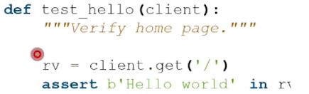 style="width:4.53336in;height:1.37564in" />executable test:

**modelbasedtesting**

> example: authenticate user before showing information scenarios:
>
> user already logged in, page shown
>
> user not logged in, redirect to login page
>
> forgot password, after resetting, come back to desiered page model:
>
> possible states (logged in, not logged in, etc) possible transitions
>
> generate tests for the possible transitions

**UItesting**

> user interface → visual output
>
> usually GUI even for web-based system
>
> but specific details of graphical display may be different in
> web-based systems tests:
>
> are specific elements present on page are navigation links present
>
> what happens on random click on some part of the page

**browserautomation**

> some tests cannot be directly run programmatically
>
> browser is required, just requests not sufficient request generation →
> python requests library, capybara
> (ruby)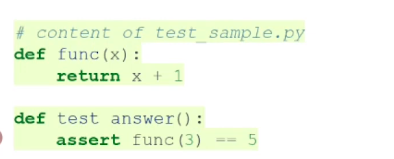 style="width:4.10607in;height:1.65702in" />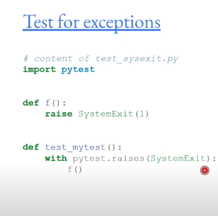 style="width:4.59588in;height:4.5542in" />
>
> direct browser automation → selenium framework → actually instantiate
> a browser examples → selenium, katalon, cucumber

**securitytesting**

> generate invalid inputs to test app behaviour try to crash server →
> overload, injections, etc black-box or whitebox approaches
>
> **fuzzing** or fuzz-testing → generate large number of
> random/semi-random inputs

**pytest**

> opinionated → provides several defaults to make it easier to write
> tests
>
> helpful features → can automatically set up env, tear down, text
> fixtures, monkeypatching, etc python standard library includes
> unittest
>
> pytest is an alternative with some more features

**textfixtures**

> set up some data before test remove after test
>
> example → initialise dummy database, create dummy users, files

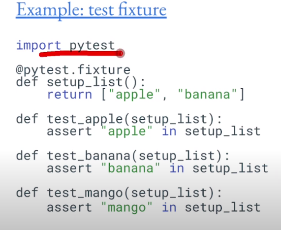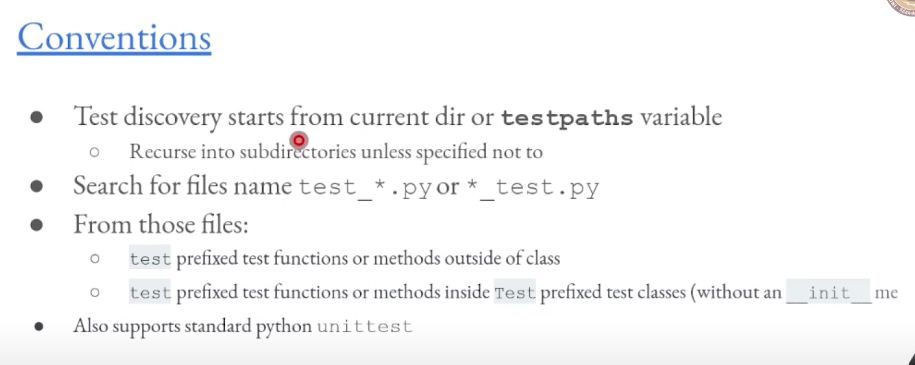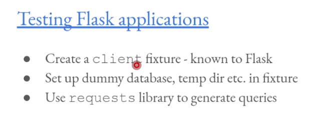

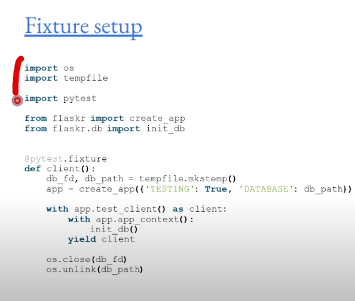

**beyondHTML**

-- subjective

**HTMLevolution**

> originas from late 60s, mostly used for typesetting and document
> management systems lack of standardization, target audience was not
> sure
>
> target output was different machine readability

**SGML**

> standard generalized markup language
>
> meant to be a base from which any ML could be designed
>
> basic postulates → declarative (specifu structure and attributes, not
> how to process them) and rigourous (strict definition of structure,
> like databases)
>
> DTD Document Type Definition → used to specify different family within
> this umbrella each could have its own tags, interpretations
>
> SGML Applications SGML was too complex

**HTML**

> originally intented to be an application of SGML
>
> very linient with parsing, meant to be forgiving of errors (not SGML
>
> HTML 2.0 attempt to become SGML complaint legacy support → not truly
> SGML complaint
>
> HTML4 official definition → true SGML application (limited usage)
> HTML5 not an SGML application → defines its own parsing rules

**XML**

> extensible markup language based on SGML
>
> custom tags - multiple appliocations defined focus on simplicity,
> generality, usability
>
> both human and machine readible
>
> well structured → can be used to represent complex data relationships,
> data structures, etc examples → mathML, RSS, Atom, SVG

**XHTML**

> based on XML not directly SGML reformulatikon of HTML4 as application
> of XML
>
> main goal is to clean up HTML specification → modular and more
> extensible XML Namespaces → allow interoperablity with other XML
> applications

**HTML5**

> add support for latest features → multimedia support, canvases, etc
> remain easily readable and understandable to both human and machine
> remain backwards compatible
>
> break away from SGML not SGML or XML define its own parser
>
> HTML5 is last version of HTML
>
> HTML Living Standard maintained by WHATWG split away from W3C

**Extensions**

> how to add new features, new tags
>
> software defined → allow new tags to be added through javascript
> custom elements → api supported by browsers
>
> very powerful mechanism → arbitrary functionality possible → no new
> tags need to be brought into standard potential problems → anyone can
> define a tag? semantics of tags may not be well thought of
>
> requirements → javascript

**javascript**

> high level programming language → dynamic typing, object orientation
> (prototype based) multi paradigm
>
> event driven
>
> functional → compositon of functions, functions as objects imperative
> → direct computation through procedures and functions
>
> relatively easy to learn → similar to python, c, java most web
> browsers have a dedicated JS enginge APIs →
>
> text, dates, regex
>
> standard data structures (dictionaries) docmuent object model -
> manipulate the page
>
> no native IO (no file access etc) but provided through APIs most power
> when used for DOM manipulation

**customelements**

> custom elements API (read more online documentation)
>
> use JS classes and inheritence and overrdiing to define custom tag
> behaviour

**webcomponents**

> custom elements is JS API to create custom element tags
>
> shadow DOM API to keep styling of components separate from rest of
> page HMTL Templates → \<templates\>and \<slot\>tags to write markup
> templates

**frameworks**

**purposeofframeworks**

> basic functionality already available
>
> python can create network listeneres, manipulate strings, etc js can
> extend elements, use API to manipulate DOM etc
>
> problem:
>
> lots of code repetition - boilerplate
>
> reinventing of the wheel - different coding styles, techniques
> Solution:
>
> standard techniques for common problems - design patterns frameworks:
> flask for python, react for js etc
>
> SPA single page applications → many JS front end frameworks focus on
> enabling this

**React**

> library for bulding UI
>
> declarative → opposed to imperative, specify what is needed, not how
> to do it components →
>
> different from WebComponents - similar ideas, different techniques
> webcomponents are imperative: functions that specify behaviour react
> is declarative → focus on UI but allow composing views

**deployment**

**appcomponents**

**developinganapp**

> idea
>
> local development file system
>
> editors, desktop, documents, file management single computer
>
> multiple services web server
>
> database server permanent deployment

**permanentdeployment**

> dedicated servers always on internet uninterrupted power
>
> infrastructure needed → data centers cloud (iaas, paas, saas)

**scaling**

> more infrastructure
>
> easy to scale up if using cloud services https, load balancer
>
> logging server many frontends many backends CDNs

**serviceapproach**

> SaaS IaaS PaaS

**whatisit**

> specialisation
>
> data center operators specialise in infra developers focus on app dev
>
> standard software deployments

**softwareasaservice**

> google docs, spreadsheets, office 365, drupal, wordpress, trello,
> redmine, etc hosted solutions → all software is installed and
> maintained by someone else

**infraasservice**

> raw machines or VM taken care of power, networking taken care of
> install your own OS
>
> VPS
>
> eg→ AWS, google compute engine, azure, digital ocean, linode

**platformasservice**

> combination of hardware and software specific hardware req
>
> specific software req
>
> custom application code (flask, ROR, laravel, etc)
>
> provider take care of power, network, infra, OS, security, base
> application platform, security updates, databases developer needs to
> manage application code and specify requirements on server sizing,
> database, connectivity scaling → combined inputs from developer and
> provider
>
> example: replit, glitch, GAE, heroku

**deployment**

**versioncontrol**

> manage changes to code retain backup of old code develop new features
>
> fix bugs

**types**

> centralised → central server, many clients. push changes to server
> each time, multiple editors, lock files, merge distributed → can have
> central server but not needed. changes managed using 'patches' -
> email, merge requests etc github, gitlab, etc
>
> centralised on top of distributed friendly interfaces
>
> worth learning commandline

**continuousintegration**

> integrate with version control
>
> multiple authors contribute to different parts of code central build
> server automatically compiles/builds code

**bestpractises**

> test driven development → write tests before code
>
> code review → pull and merge requests, enabled by web interfaces.
> review code for correctness, cleanliness, etc
>
> integration pipeline optimization → tests run on each push to server,
> can be several times a day. fast runs, optimised based on changes ,etc

**ContinuousDelivery/Deployment**

> CI/CD part of DevOps pipeline CI continuous integration
>
> CD could be Continuois Delivery or Deployment

**continuousdelivery:**

> once CI has passed, package files for releasse
>
> automated delivery of release package on each successful test nightly
> builds, beta testing, up to date code version

**continuousdeployment:**

> extend beyond delivery - deploy to production passed tests → deployed
> to users
>
> users see latest version that has passed tests
>
> no installing new versions/upadting code on servers benefits
>
> immediate fixes, upgrades
>
> latest features deployed immediately drawbacks:
>
> tests may not catch all problems

**containers**

**what**

> self contained env with OS and min libraries
>
> primarily used with linux kernel namespaces, others like chroot
> possible

**why**

> full OS imposible to version control - too much software create
> self-contained images that can be version controlled sandboxing -
> image cannot affect other processes on system

**how**

> kernel level support needed
>
> all communication inter-container networking

**history**

> chroot - custom filesystem for part of the code. no real process
> isolation
>
> freeBSD jails, linux VServer, OpenVZ containers in linux, same kernel.
> different filesystesm control group namespaces (cgroups) → linux
> kernel 2008 process isolation through namespaces
>
> docker → mechanism for managing images, popularized containers,
> problems: bad practises, version control hard

**orchestration**

> app consists of multiple processess not just one start in some
> specific order (dependencies)
>
> communicate between processes that are isloated (network) mechanisms
> to build and orchestrate, automate
>
> docker-compose kubernetes
>
> key to understanding and managing large scale deployments
